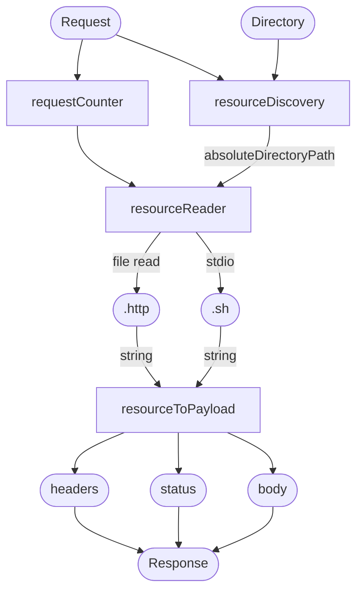

```mermaid
    flowchart TB
        request([Request]) --> requestCounter
        request --> resourceDiscovery
        rootpath([Directory]) --> resourceDiscovery
        
        resourceDiscovery -- absoluteDirectoryPath --> resourceReader
        
        requestCounter --> resourceReader
        
        resourceReader -- file read --> .http
        resourceReader -- stdio --> .sh
        
        .http([.http]) -- string --> resourceToPayload
        .sh([.sh]) -- string --> resourceToPayload
        
        resourceToPayload --> payloadHeaders([headers])
        resourceToPayload --> payloadStatus([status])
        resourceToPayload --> payloadBody([body])
        
        payloadHeaders([headers]) --> response([Response])
        payloadStatus([status]) --> response([Response])
        payloadBody([body]) --> response([Response])
```